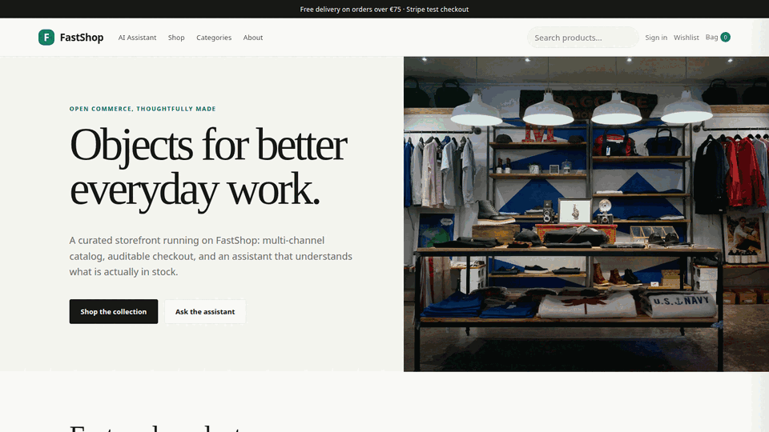
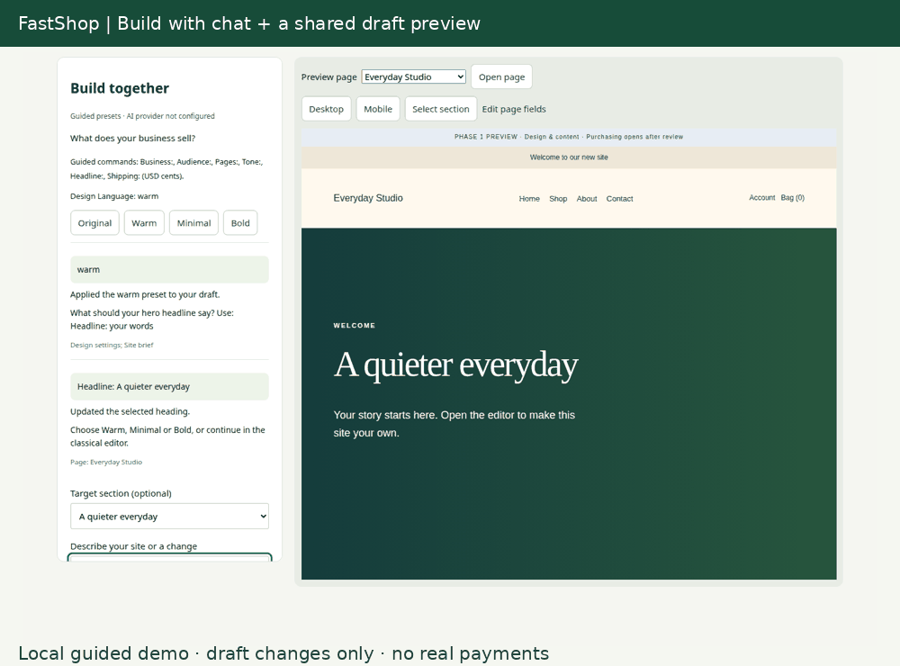

# FastShop

FastShop is a Python-first ecommerce storefront and merchant workspace built
with FastHTML, SQLAlchemy, and a mounted FastAPI integration surface. It is an
independent MIT implementation informed by Frappe Webshop's SMB journeys and
Saleor's domain boundaries.

Production target: <https://shop.fastsme.com>
Repository: <https://github.com/predictivelabsai/FastShop>

[](https://shop.fastsme.com)
[](https://github.com/predictivelabsai/FastShop/actions/workflows/ci.yml)
[](LICENSE)

[](https://shop.fastsme.com)

**[Open the live shop →](https://shop.fastsme.com)**

## Included vertical slice

- responsive storefront, categories, search, variants, live stock, reviews,
  wishlist, cart, voucher, checkout, and order confirmation;
- multi-tenant, multi-channel, product-type, attribute, warehouse, stock,
  allocation, payment, outbox, and external-mapping foundations;
- merchant dashboard for products, orders, inventory, promotions, channels,
  customers, content, and FastERP connection health;
- top-left AI Assistant entry and a grounded shopper drawer on every public
  page, plus a persistent merchant copilot on every admin page;
- Google authorization-code OIDC with state, PKCE, verified email, optional
  domain/email allowlists, role lookup, safe return paths, secure production
  cookies, and a development-only local login;
- versioned REST/OpenAPI endpoints under `/api`, discovery documents, Alembic
  migrations, Docker health checks, and GitHub CI;
- idempotent confirmed-order delivery to FastERP through a transactional outbox
  and a dedicated connector token—never by cross-schema writes.

## Editable websites — Phase 1

The H2 4 You design/content preview lives at `/sites/h24you/`. Authorized merchants
can create their own sites at `/admin/sites`, edit sections and shared settings,
upload media, manage product presentation, preview drafts and publish revisions.
The new storefronts do not activate the legacy demo checkout. Phase 2 commerce
is implemented locally in sandbox-only mode; real-provider acceptance and release
remain separate gates. Do not assume the production target runs the local worktree.

- [Phase 1 delivery and placeholder register](docs/H24YOU_PHASE1_DELIVERY.md)
- [Merchant editing guide](docs/PHASE1_MERCHANT_GUIDE.md)
- [Phase 2 commerce implementation roadmap](docs/PHASE2_COMMERCE_ROADMAP.md)
- [Browser verification evidence](output/playwright/h24you-phase1/verification.json)

## Dual-flow builder and private commerce demo

Build a site with classical forms or a guided chat beside the same draft preview.
Use shared design controls, section targeting and undo without publishing changes.
The configured model enables natural-language editing; without a key, the UI
explicitly offers a guided preset wizard.

The merchant-only simulator exercises synthetic checkout, subscriptions, account
confirmation, tracking and a local inbox without payment/email credentials. Its
sample products and orders are isolated from real catalog and commerce records.



- [Screenshot-led user guide](docs/USER_GUIDE.md)
- [Implementation status and provider acceptance limits](docs/DUAL_FLOW_IMPLEMENTATION_STATUS.md)
- [Dual-flow architecture and acceptance plan](docs/DUAL_FLOW_SITE_BUILDER_PLAN.md)

These screenshots and the GIF demonstrate local fixtures, not real payments or
proof of deployment. See the implementation status for checks and provider limits.

## Run locally

```bash
uv sync --extra dev
uv run alembic upgrade head
uv run python web_app.py
```

Open <http://localhost:5025>. The development account in `.env.sample` is for
local use only. Copy `.env.sample` to the git-ignored `.env` when you need local
overrides; never commit credentials.

Run checks with an isolated SQLite database even when a production `.env` has
been prepared:

```bash
DB_URL= FASTSHOP_ENV=development FASTSHOP_AUTO_CREATE_SCHEMA=1 uv run ruff check .
DB_URL= FASTSHOP_ENV=development FASTSHOP_AUTO_CREATE_SCHEMA=1 \
  FASTSHOP_DATA_DIR="$(mktemp -d /tmp/fastshop-tests-XXXXXX)" \
  XAI_API_KEY= POSTMARK_API_TOKEN= POSTMARK_SERVER_TOKEN= \
  STRIPE_SECRET_KEY= STRIPE_WEBHOOK_SECRET= uv run python -m pytest -q
```

## Production configuration

FastShop shares the FastSME PostgreSQL server but owns only the `fast_shop`
schema. The Docker entrypoint applies Alembic migrations before starting the
ASGI server. FastDevOps supplies the Coolify runtime, generated secrets, Google
OAuth client, AI/email keys, and the FastERP connector token.

Prepare the ignored local deployment env without printing secret values:

```bash
uv run python scripts/prepare_env.py \
  --db-source ../FastERP/.env \
  --shared-source ../FastDevOps/.env \
  --target .env
```

Review the dry run, then repeat with `--apply`. The Google OAuth client must
register this exact callback:

```text
https://shop.fastsme.com/auth/google/callback
```

Validate and deploy through the shared control plane:

```bash
uv run python scripts/coolify.py validate
uv run python scripts/coolify.py doctor
uv run python scripts/coolify.py provision
uv run python scripts/coolify.py deploy
```

## Browser evidence

Playwright captures are stored in `output/playwright/`, including desktop and
mobile home pages, catalog, product detail, cart, checkout, order confirmation,
login, the shopper assistant, merchant copilot, and FastERP integration view.
The same directory also retains the Frappe and Saleor reference captures used
during discovery.

## Architecture and ownership

FastShop owns the online catalog presentation, channel prices, carts, checkout,
payment events, storefront customers, and customer-facing order experience.
FastERP owns authoritative accounting, invoices, purchasing, and warehouse
movements. Confirmed FastShop orders are staged through a company-scoped,
token-gated, idempotent FastERP endpoint and reconciled asynchronously.

See [the migration and delivery plan](docs/FASTSHOP_MIGRATION_PLAN.md),
[the FastERP contract](docs/FASTERP_INTEGRATION.md), and
[third-party notices](docs/THIRD_PARTY_NOTICES.md).
