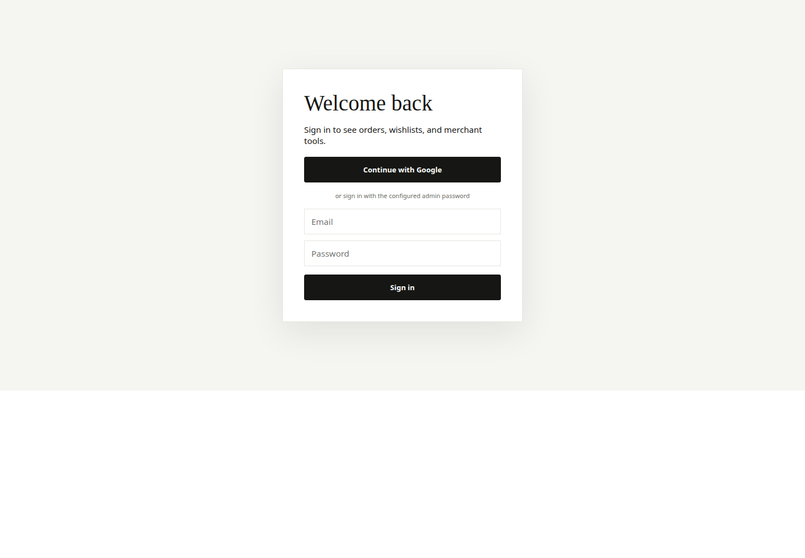
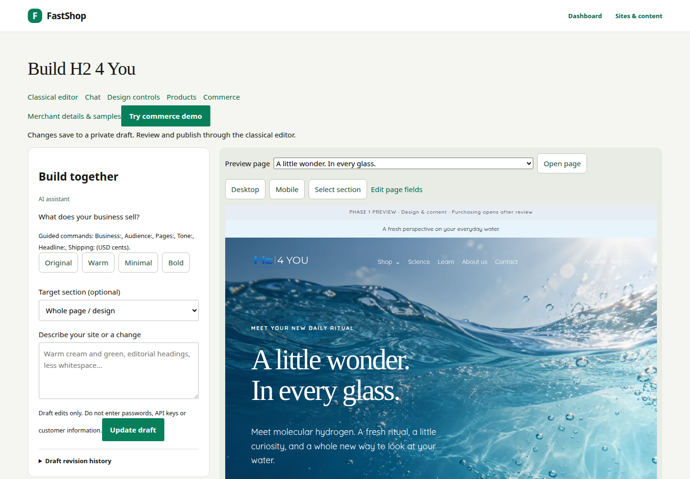

# Production verification — H24YOU guide

> **Reconciliation note (2026-09-23):** the "212 tests" figure recorded for the
> 21 September deployment is historical. The current worktree is at Alembic head
> `20260923_0015` with **259 passing** tests. This document describes the earlier
> deployed commit; it is not a claim about the current worktree. See
> [CAPABILITY_MATRIX.md](CAPABILITY_MATRIX.md).

Verified on **21 September 2026** at **https://shop.fastsme.com**.

## Release and deployment

- Application/guide commit: `7785097da562491aa5cf6110bfe4b3772c3e62a2`.
- GitHub CI run `35644895149`: successful (lint, compile, migrations, tests, Docker).
- Coolify deployment `duyx5xzzrwwjaqeyvbbwh5yo`: finished for that exact commit;
  application `5viha2cznbkukfszrowsqvsr` is running/healthy and `/healthz` returns 200.
- Deployment was explicitly requested through the Coolify API. No repository
  webhook was listed by GitHub; a push alone was not treated as deployment proof.
- Local release suite: **212 passed**, plus seven focused guide/auth tests after
  making the source-brief link portable. Alembic upgrade/check, Ruff, compilation
  and diff checks passed. One upstream Starlette/AnyIO deprecation warning remains.

## What was tested on production

| Area | Result |
|---|---|
| H24YOU public pages | All 17 routes returned 200 at desktop, tablet and mobile sizes: 51 checks |
| Responsive structure | One page heading and no horizontal overflow on those routes |
| Platform readiness/assets | Home, health, readiness and builder JS/CSS returned 200 |
| Admin password sign-in | Successful with the configured account; Google sign-in option retained |
| H24YOU merchant views | Shared settings, builder, design, products, commerce and sample-review forms returned 200 |
| Private editing fixture | Created with sample details; classical design save and undo succeeded |
| Configured model | Requested tagline persisted in the private draft through the production model adapter |
| Private commerce simulator | Newsletter confirmation/offer, recurring checkout, local account, skip/pause/resume/cancel, tracking and inbox passed |
| Private storefront boundary | Test site's public URL remained 404 |
| Authentication rejection | Wrong password and invalid CSRF rejected; unauthenticated admin access redirected to login; anonymous private-site request returned 404 |
| Browser execution | No uncaught page JavaScript errors in the run |

Machine-readable evidence and screenshots:
[`output/playwright/production-guide-verification/verification.json`](../output/playwright/production-guide-verification/verification.json).

## Test-data boundary

The only editing/checkout fixture created was **Private production check —
prod-check-b08a783b92**, an unpublished merchant-owned site. It is retained for
inspection in Sites & content. Its orders, subscriptions and messages are
simulations in the dedicated demo store, not real customer commerce records.
No H24YOU page/shared-content publication was performed. No real payment, customer
marketing message, contact-form delivery or fulfillment request was tested.

The guide's 39-page PDF/PPTX still uses clearly labelled local H24YOU screenshots.
The evidence above checks the corresponding deployed workflows; it does not
retroactively turn those images into production captures.

## Authentication handling

Production password login is explicit opt-in for the configured administrator.
The server receives a salted PBKDF2 hash, not the plaintext password. Credentials
are held only in a local ignored 0600 file inside a 0700 directory, excluded from
Git and Docker. Google SSO was left enabled; its full provider handshake was not
retested. Password checks are bounded per application worker.

## Not covered by this production run

- Real Stripe tax/payment acceptance, payment-method wallets or recurring charges.
- Provider-delivered email, real shopper identity, carrier API synchronization.
- Every prompt in the guide; only one real model draft operation was exercised.
- Final product facts, research numbers, policy wording or regulatory approval.
- Load testing, multi-worker distributed throttling or exhaustive security testing.

These remain separate from proving that the guide's site-builder and simulation
interfaces exist and work on the deployed application.
