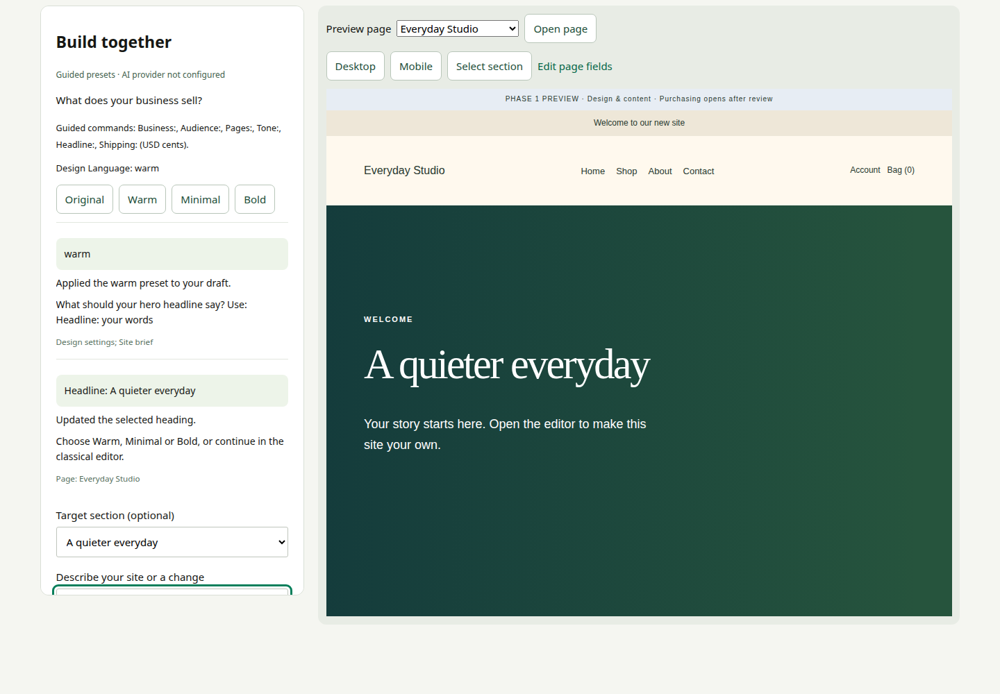
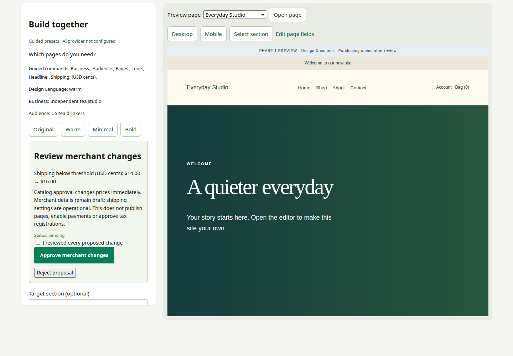
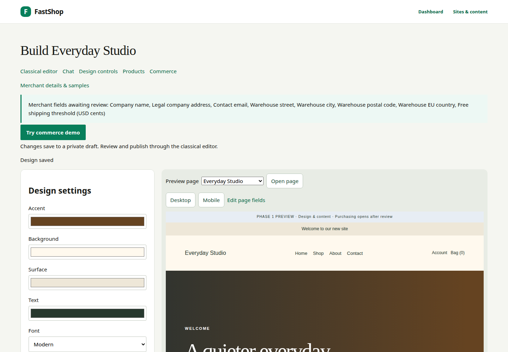
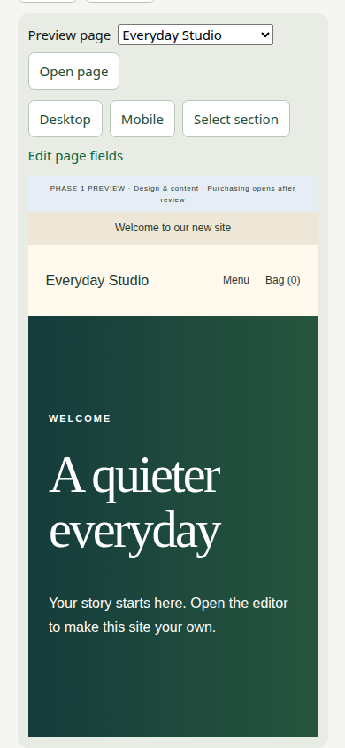
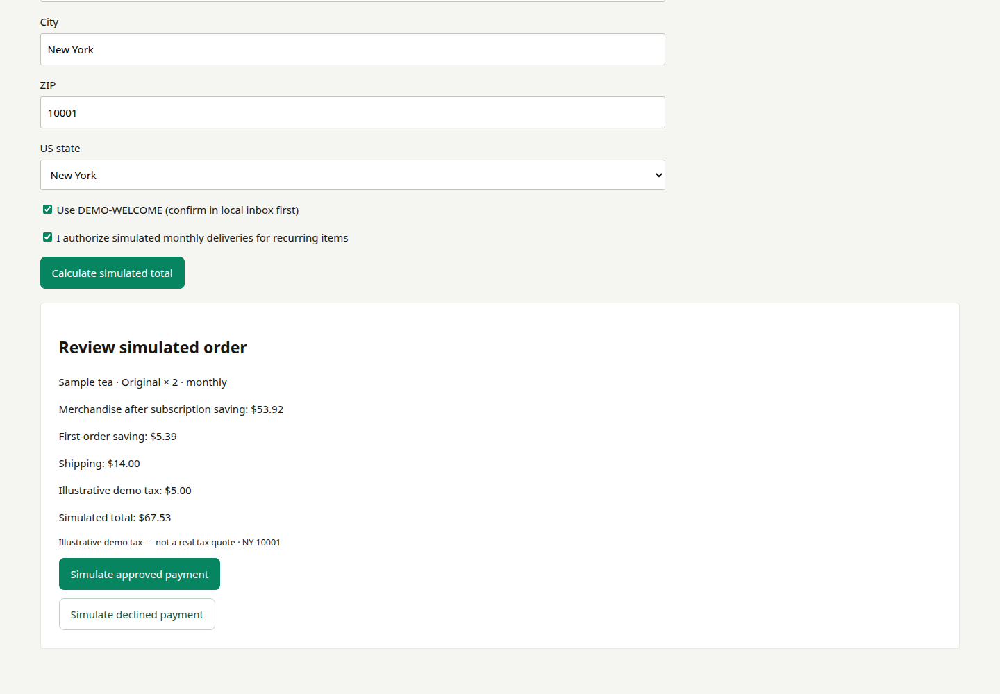
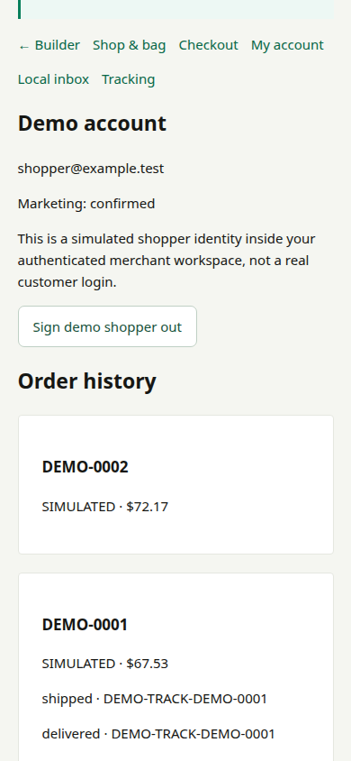
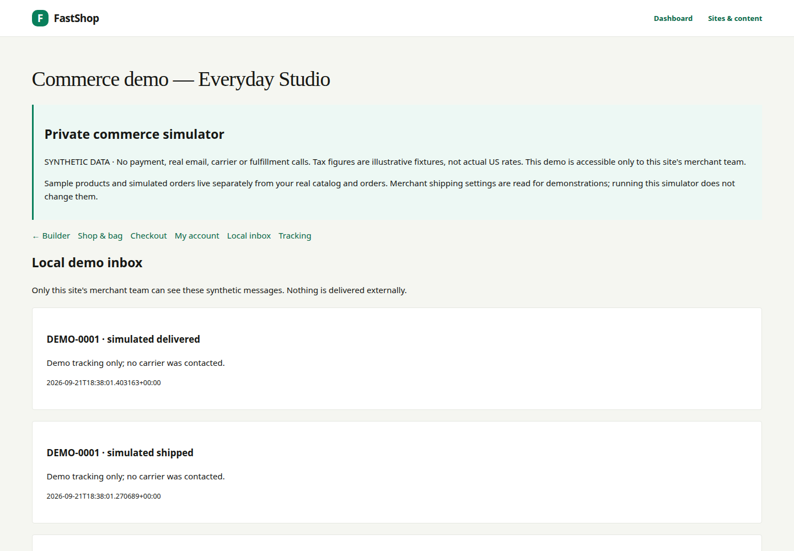

# FastShop user guide

User guide for the locally implemented dual-flow site builder, merchant approval
cards and isolated commerce simulator. Screenshots use synthetic data and guided
presets; they are not evidence of a live model or payment-provider acceptance.

## 1. Create your site

Sign in at `/login`, then open **Sites & content**. Enter a site name and a unique
address. Choose **Classical editor** or **Build with AI / guided presets**. These
are two interfaces to the same site, not separate copies.

Select **Start with clearly labelled sample merchant details** if you want sample
company, warehouse and shipping values. New sites are private drafts. Sample
details do not enable payments or create real provider credentials.

## 2. Build with chat and preview

Open **Build with AI** from the site's editor. On desktop, the conversation is on
the left and the draft preview is on the right. On a phone, use **Editor** and
**Preview** tabs. The page selector switches the page being discussed; **Desktop**
and **Mobile** change the preview width.

When a model provider is configured, describe your business, audience and design
preferences. For example: “Warm cream and forest green, editorial headings and
less whitespace.” Design and copy changes save to the draft and refresh the
preview. Nothing is published automatically.

To focus an edit, choose **Select section** above the preview and click a section,
or use the **Target section** dropdown. The target is checked against the selected
page on the server. Turn selection mode off to interact normally with the preview.
Keyboard users can focus a section and press Enter while selection mode is on.

Without a provider, the workspace says **Guided presets · AI provider not
configured**. Choose **Warm**, **Minimal**, **Bold** or **Original**. To edit a hero,
enter `Headline: A quieter everyday`. This fallback is a preset wizard, not an
LLM; open-ended requests need a configured provider.

Record your brief progressively with `Business:`, `Audience:`, `Pages:` and
`Tone:`. Presets record your design preference. Saved answers remain visible,
and the next question skips answers already supplied. In guided mode these
commands record the brief; they do not automatically compose all requested pages.

Never enter passwords, payment details, API keys or customer records in chat.
For prices, shipping and subscription configuration, use the dedicated merchant
controls or ask the configured assistant for a proposal. The assistant does not
autonomously change financial settings.

### Review operational proposals

Shipping, merchant details, catalog products and prices appear in **Review merchant
changes** cards. The guided command `Shipping: 1600` demonstrates a $16 proposal.
Nothing changes until a merchant checks **I reviewed every proposed change** and
chooses **Approve merchant changes**. Reject discards the proposal. If the draft or
merchant data changed meanwhile, ask for a fresh proposal.

Approved catalog changes take effect immediately; shipping changes are operational.
Page publication, tax registration review, credentials and payment activation are
never model operations. Merchant-detail proposals currently require commerce disabled.

## 3. Switch to classical controls

Choose **Design controls** to edit colors, typography, spacing, corner radius,
content width and hero alignment with forms. These controls update the same
settings as chat. Choose **Classical editor** for pages, shared content, navigation,
products, media and publication.

The FastShop administration branding stays fixed. Your selected design applies
to the merchant storefront, not the platform's logo or controls.

## 4. Replace sample merchant details

Open **Merchant details & samples**. **Fill missing fields with sample data** is
available for private draft sites with commerce disabled. It does not overwrite
existing merchant values or reseed fields already reviewed.

Replace company name, legal address, contact email, warehouse details and shipping
amounts. Legal address and fulfillment origin are separate. Amounts are currently
entered in USD cents: `1400` means $14.00; `7500` means $75.00.

Explicitly check **I have reviewed this value** for each confirmed field and save.
An unreviewed synthetic value is not an approved policy. Saving these details does
not approve tax registrations, activate Stripe, publish the site or send email.
Changing a reviewed value through ordinary settings marks it for review again.
The classical editor and builder list outstanding reviews. Clear those reviews
before enabling Stripe sandbox; demo checkout remains available without them.

## 5. Undo and conflicting edits

Expand **Draft revision history** for the latest 50 classical/AI changes and their
timestamps. History is read-only apart from undoing the current unchanged revision;
older page revisions can be restored through the classical page editor.

**Undo latest change** restores the previous unchanged builder draft and creates
a new revision. It does not reverse payments or alter the published storefront.
If another editor has changed the draft, reload before retrying. The builder
rejects stale AI results rather than overwriting newer manual work.

If a request fails, keep your previous draft and reload to check its current
state. A network timeout is not proof that the operation was never applied;
duplicate submission of the same command does not apply the edit twice.

While waiting, **Cancel pending edit** prevents a late model result from changing
the draft. After reloading, pending requests also have a cancel control in the
conversation. Cancellation cannot reverse an edit that has already committed and
does not guarantee that a provider stops processing or charging for model usage.
Classical page/shared-content saves are also recorded in the shared draft history.

## 6. Review and publish

Return to the classical editor, review each page and shared settings, and use its
explicit publication controls. Private previews do not initialize analytics or
take payments. Review placeholder copy, product facts, policies and merchant
details before exposing a store publicly.

For the existing Stripe sandbox setup, accounts, subscriptions, manual tracking
and email operations, see [sandbox operations](PHASE2_SANDBOX_OPERATIONS.md).
Real-provider acceptance is distinct from a local guided-builder demonstration.

## 7. Mobile workspace

Use **Editor** to return to the conversation or forms. The page remains the same
stored draft when switching tabs or returning to desktop.

## 8. Try commerce without credentials

Choose **Try commerce demo** and then **Start private demo**. This is an
authenticated merchant-team simulation, not a public store or Stripe test
checkout. It works without Stripe, email or carrier credentials.

The simulator has its own sample catalog, stock, shopper, orders, subscriptions
and messages. Editing these samples does not modify real catalog/stock records.
Nothing is promoted automatically to a real store when Stripe is configured.
Configure real products and providers separately through the normal merchant
controls; never treat successful simulation as real-provider acceptance.

### Sample shop and email offer

In **Shop & bag**, choose a quantity and one-time or monthly purchase, then
**Set bag quantity**. Setting zero removes that matching line. Expand **Edit
sample product / stock** to change a sample's name, integer-cent price and stock.
Changing a sample invalidates any pending simulated quote.

Tick the separate marketing-consent checkbox and request the demo welcome offer.
Open **Local inbox**, confirm the demo newsletter and receive `DEMO-WELCOME`.
Newsletter confirmation does not sign in the demo shopper. Withdraw marketing
consent from the shop; this does not remove transactional order receipts.

### Checkout and simulated payment

In **Checkout**, enter a synthetic US state/ZIP delivery address. Optionally use
the confirmed first-order offer and explicitly authorize recurring deliveries
for monthly items. Calculate and review the simulated total.

Subscription merchandise receives 10% off; the first-order offer reduces that
merchandise subtotal by a further 10%, once. Renewals exclude the welcome offer.
Shipping uses the site's configured cents/threshold, or illustrative defaults of
$10 and $75 when unconfigured. Tax varies by demo state fixtures and is prominently
labelled **not a real tax quote**. Do not use it to determine collection obligations.

Choose **Simulate approved payment** or **Simulate declined payment**. Approved
orders receive `DEMO-` numbers and only reduce simulated stock. No money moves,
no real payment identifiers are generated, and no fulfillment event is exported.

### Account, subscriptions and tracking

Use **My account → Send local demo sign-in**, confirm in **Local inbox**, then
return to **My account**. The synthetic shopper can see simulated orders and
manage skip, pause/resume, frequency, flavour, address, payment method and cancel.
These controls model the flow inside your merchant session; they are not a real
customer authentication system or card-update form.

**Simulate next renewal** advances one sample delivery without waiting for its
scheduled date. A failed renewal pauses the sample subscription. Changing a
sample price will not silently change an existing agreed recurring price.

In **Tracking**, mark an order shipped and then delivered. Events appear in the
demo account and create local messages. No carrier is contacted.

### Local inbox and operational boundary

All demo confirmations, offers, receipts, shipment updates and failed-renewal
messages stay in **Local inbox**. Confirmations are single-use and expire after
30 minutes. No Postmark message is queued, even if real email credentials exist.

Demo records live in dedicated tables, outside real order/payment/mail/outbox
tables. Repeated submissions with the same command identifier do not duplicate
an order. Stale tabs must reload rather than overwrite newer demo state.
