::: cover

# FastShop

#### User Guide — Build and Run Your Own Store

**Classical editing. Conversational building. One shared site.**

Worked example: H2 | 4 YOU · h24you.com

21 September 2026 · Local demonstration edition

:::

---

## Contents

| Section | Pages / slides | What you will do |
|---|---:|---|
| **01 · Get started** | 3–6 | Understand the two flows and the H24YOU page plan |
| **02 · Build with classical controls** | 7–13 | Edit pages, products, media, shared content and research |
| **03 · Build with chat** | 14–26 | Use the H24YOU prompt library, preview changes and undo |
| **04 · Prepare commerce** | 27–34 | Review merchant data; try checkout, subscriptions, accounts and email |
| **05 · Review and launch** | 35–39 | Separate Phase 1 approval from commerce acceptance; replace placeholders |

The PDF and PowerPoint use the same page/slide sequence, following FastClinic's
sectioned guide pattern. Screenshots show a local H24YOU fixture—not a live-site
audit, an actual customer, a payment-provider test or regulatory approval.

Production workflows were checked on 21 September 2026. See the
[production verification report](PRODUCTION_GUIDE_VERIFICATION.md) for coverage
and exclusions; the guide screenshots remain local examples.

---

::: divider

## Get started

Use H24YOU as a worked example. Build the design and content first, review it,
then prepare commerce in a separate, explicitly approved phase.

:::

---

## Your sample store: H2 | 4 YOU

H24YOU demonstrates a content-rich US store: hydrogen tablets in **Unflavoured,
Raspberry and Pineapple**, plus a branded **Hydroxy Go bottle**. The brief specifies
English and USD. In running copy use **H2 4 You**; the logo uses **H2 | 4 YOU**.

FastShop is the platform. Your storefront has its own visual identity; FastShop's
merchant controls retain FastShop branding.

The original brief requested Shopify. The subsequent implementation direction
uses **FastShop's embedded content editor and Stripe boundary**, not Shopify
hosting, Shopify Email or Shopify Subscriptions. No domain/DNS setup is implied.

---

## Sign in and choose your building flow

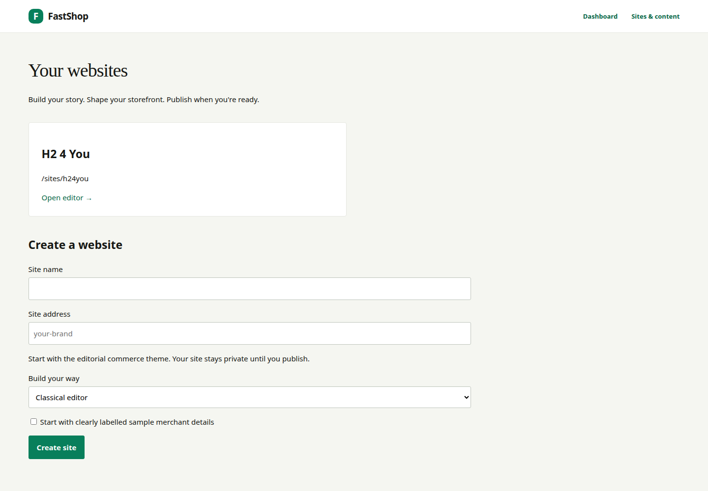

1. Sign in at your FastShop installation's `/login`.
2. Open **Sites & content** at `/admin/sites`.
3. Open **H2 4 You**, or enter a new site name and unique slug.
4. Choose **Classical editor** or **Build with AI / guided presets**.
5. Optionally start a new private site with labelled sample merchant details.

Both flows edit the same draft. Switching flows does not duplicate the site.
For the sample storefront, `/sites/h24you/` works when its preview is published.
The builder's authenticated preview remains the place to inspect unpublished edits.

---

## Plan H24YOU's pages before editing

| Area | Pages and purpose |
|---|---|
| Home and Shop | Home, Shop, Hydrogen Tablets collection, Hydrogen Water Bottles collection |
| Products | Hydrogen tablets; Hydroxy Go bottle |
| Science | Research library, source links and grouped research themes |
| Learn | Index plus three educational launch articles |
| Company | About us; Contact |
| Policies | Terms and Conditions; Privacy Policy; FAQ; Returns and Refunds |
| Shared components | Header, menu, footer, announcement, first-order banner, cookie preferences |

The seeded example contains **17 page routes**. Navigation and legal links are
shared settings; articles and product storytelling are editable pages. Underlying
product variants and prices are separate catalog records.

---

::: divider

## Build with classical controls

Use forms when you know exactly what to change. Save drafts, preview them and
publish deliberately. These are the same drafts that chat edits.

:::

---

## Brand, navigation, banner and footer

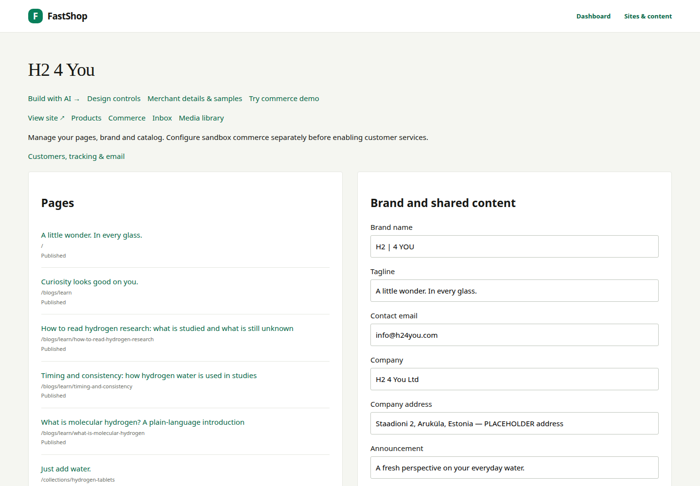

Open the **Classical editor**. In **Brand and shared content**, edit the brand
name, tagline, contact email, company details, announcement and first-order banner.
Set menu labels/paths, social links, research figures and the footer disclaimer here.

For H24YOU, keep **Shop, Science, Learn, About us, Contact** in the main menu.
Use the supplied dark logo on light backgrounds and the light logo on dark media.

Choose **Save draft settings** first. **Publish shared settings** exposes the
reviewed shared content. The brief's legal address is a placeholder—not a confirmed
warehouse address. Changing a reviewed merchant value requires another review.

---

## Edit a page without code

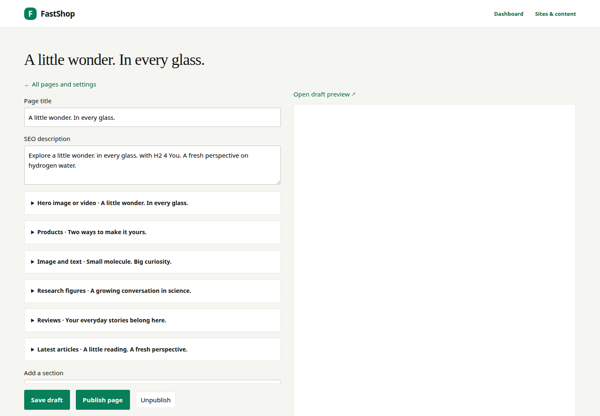

1. Open the page from the site's page list.
2. Edit its title and SEO description.
3. Expand a content section to change its heading, body, image or link.
4. Add supported sections; reorder or remove them using the editor controls.
5. Choose **Save draft** and inspect the private preview.
6. Use **Publish page** only after review.

For H24YOU's home page, retain the sequence: hero, products, research counters,
research introduction, clearly labelled review area and latest Learn articles.
Page revisions allow restoration; a draft save alone does not replace published content.

---

## Product records versus product pages

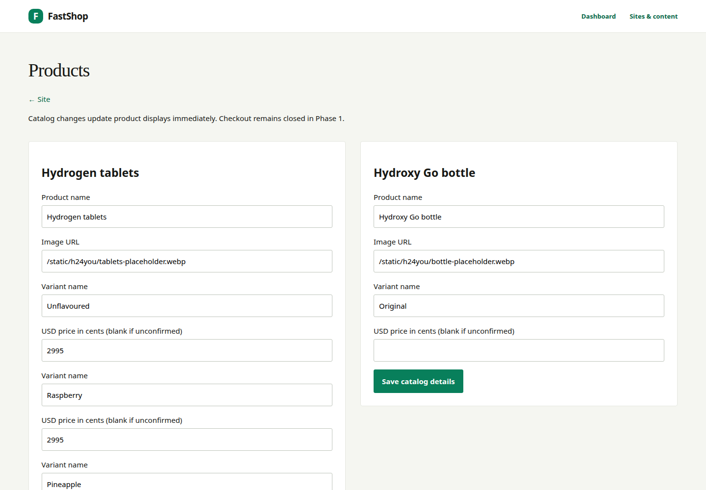

Use **Products** for names, variants, product images and prices. Use the page editor
for the gallery, introduction, accordions and supporting content.

- Tablets: Unflavoured, Raspberry and Pineapple.
- The brief's **$29.95** price is **2995 USD cents** and remains provisional.
- The bottle's final USD price must be supplied; do not invent a conversion.
- Leave ingredients and Supplement Facts visibly pending until supplied.

Catalog changes can affect operational prices immediately; they are not page-draft
edits. Configure monthly tablet eligibility separately in **Commerce**. The bottle
should not inherit tablet subscription eligibility.

---

## Replace media and preview mobile layouts

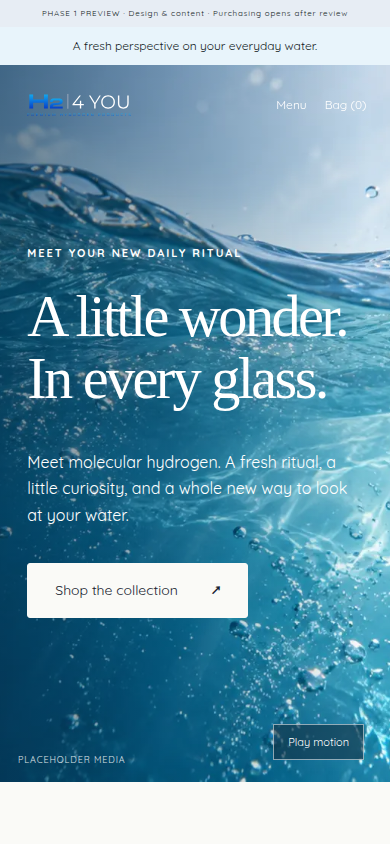

Upload approved images through **Media library**, with meaningful alt text. Copy
the resulting URL into the page's image field. Keep placeholder labels until the
asset is genuinely replaced.

H24YOU's supplied SVG logos are brand assets; generated product/lifestyle images
and motion studies are concepts, not actual product or customer photography.

Inspect phone, tablet and desktop layouts. Check the mobile menu, product gallery,
readable text, focus states and video pause control. The brief requests a compressed
hero with a mobile fallback; the final media still needs merchant approval.

---

## Science and Learn: edit, source, review

The brief supplies counters **2,000+**, **120+** and **68**. These are supplied draft
figures, not figures verified by this guide. Keep the source and confirmation date
visible, and recheck them before publishing.

Use neutral research descriptions and original-source links. Do not place product
buy buttons inside study lists. Keep unapproved benefit statements disabled in
shared settings; an AI edit is not regulatory approval.

Learn has three draft launch articles. Review the full text, author label, source
links and study-reference boxes before publication. The prompt library later in
this guide identifies each article and its brief-supplied references.

---

## Contact, cookies and analytics

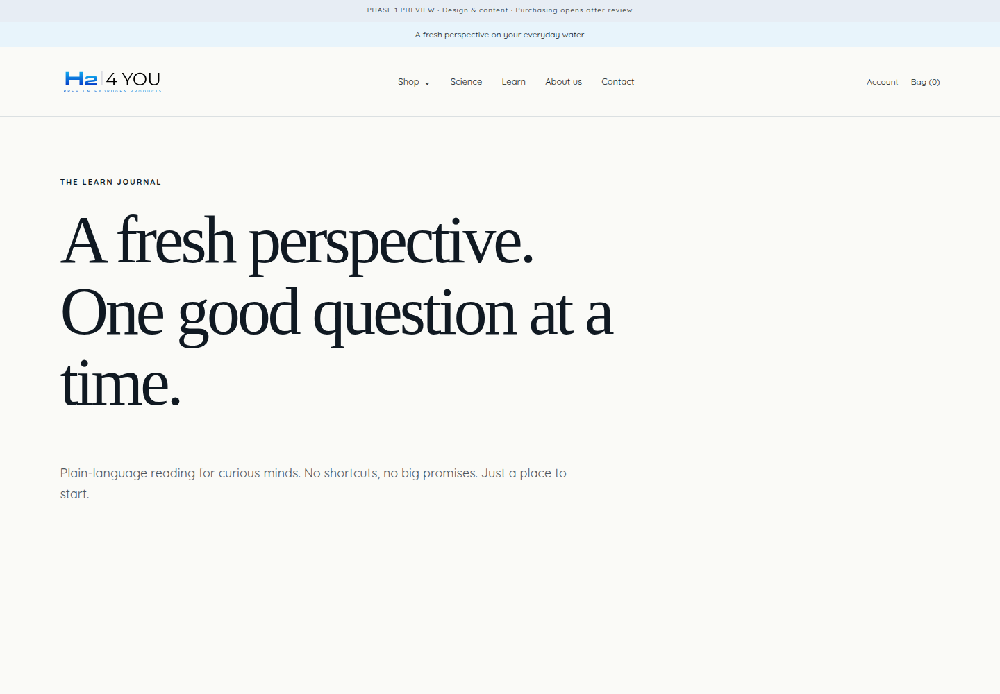

Set **info@h24you.com** as the brief's contact destination, then verify delivery in
the deployed environment. Contact entries are retained in **Inbox**; a stored entry
is not proof that an email was delivered.

Review cookie **Accept**, **Decline** and **Preferences** behavior. Optional GA4 is
configured in shared settings and should load only after analytics consent on
public pages. Private previews are not an analytics acceptance test.

The brief says **no Meta pixel yet**. Marketing opt-in is separate from contact
messages and account/order email. Replace privacy and other legal placeholders
with reviewed text before public launch.

---

::: divider

## Build with chat

Ask for one focused change, inspect the actual draft and keep editorial control.
The following prompt library turns the H24YOU brief into repeatable tasks.

:::

---

## The chat workspace and its limits

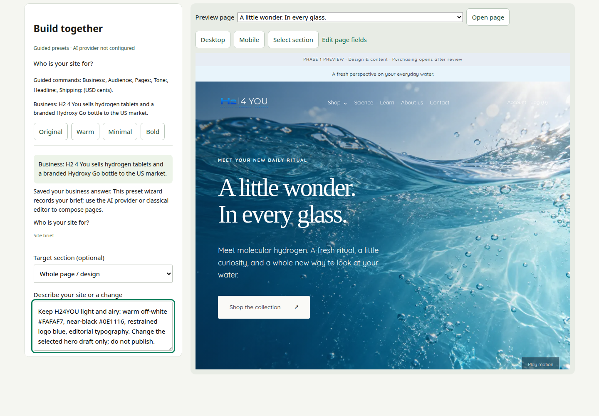

Choose **Build with AI**. Select a page, then use **Select section** or **Target
section** to focus the request. The preview refreshes after a validated draft save.
On phones, switch between **Editor** and **Preview**.

With a configured model, use the natural-language prompts on the following pages.
The server accepts only supported structured edits—not arbitrary code, payments
or autonomous publication.

Without a key, the label says **Guided presets · AI provider not configured**.
The screenshot contains a prepared natural-language request, not evidence that an
LLM executed it. Do not paste the entire brief: messages are limited to 4,000 characters.

---

## Start with the brief's original phase instruction

**Original wording — brief §0.** Use this to establish the review boundary; it is
an instruction to the assistant, not a substitute for the publication controls.

> Build in two phases and show me the result of Phase 1 before starting Phase 2.
>
> Phase 1 – Design and content: home page, Shop, product pages, Science, Learn
> (3 articles), About us, Contact, header, footer, banner, cookie banner.
>
> Phase 2 – Commerce: subscriptions, tax and shipping settings, checkout, discount
> codes, My account, order tracking, email capture.
>
> If any instruction here is unclear or two instructions conflict, ask me before guessing.

For this FastShop implementation, add: **“Use FastShop's existing components.
Keep all edits as drafts. Do not enable commerce or publish without my approval.”**

---

## Save your H24YOU brief one answer at a time

**Copy-ready guided commands — adapted from brief §§1, 3 and 5.** These work in
the labelled preset fallback as well as providing a useful outline for AI chat.

> Business: H2 4 You sells hydrogen tablets and a branded Hydroxy Go bottle.

> Audience: US customers; English-language site; prices in USD.

> Pages: Home, Shop, tablet and bottle collections and products, Science, Learn
> with three articles, About us, Contact, Terms, Privacy, FAQ and Returns.

> Tone: Warm, energetic, curious and confident. Short, lively sentences.
> Enthusiasm about the experience and research, not health promises.

**Expected result:** the answers appear in the saved brief and the next question
advances. Guided mode records the page plan; it does not generate all those pages.

---

## Prompt: H24YOU's design language

**AI prompt — adapted from brief §3.** Select the home page. Split further if the
assistant asks which section to change.

> Keep H24YOU clean, modern, fresh and premium but approachable. Use warm
> off-white #FAFAF7, white and near-black #0E1116. Use logo blue sparingly, with
> pale aqua #E8F4FB and sand #EFE8DE accents. Keep the site light and airy.
> Prefer editorial typography, generous whitespace and asymmetric composition.
> Avoid purple/rainbow gradients, glowing orbs, endless identical rounded cards
> and filler slogans. Update supported design settings only. Preserve the logos
> and FastShop administration branding. Keep the changes in draft.

**Review:** inspect desktop and mobile. Bounded theme controls cannot express
every design detail. Lovera requires the supplied licensed font; the H24YOU fixture
uses a heading fallback and local Quicksand. Chat does not install arbitrary fonts.

---

## Prompt: home hero and content rhythm

**AI prompt — adapted from brief §§3 and 5.1.** Target the home hero first.

> Rewrite this H24YOU hero with a short, original headline and a Shop call to
> action. Make it warm, energetic and curious, focused on the first glass and
> everyday ritual. Do not promise health outcomes or reuse another brand's
> slogan. Keep the water imagery visibly identified as placeholder content.
> Change only this section's copy; do not publish.

Then select the next section and ask for its specific edit. Keep research figures
in their shared settings rather than inventing new counters in body text.

**No-key exercise:** `Headline: A little wonder. In every glass.` updates the
selected heading. It does not create a video or rebuild the entire home page.

---

## Prompt: tablets and bottle storytelling

**AI prompt — adapted from brief §§5.3–5.4.** Select the tablets product page and
the relevant text section; use catalog forms for variants and prices.

> Draft inviting H24YOU tablet copy around convenience, flavour and the daily
> water ritual. Flavours are Unflavoured, Raspberry and Pineapple. Keep $29.95
> per box and pack size marked for confirmation. For ingredients and product
> details use: “Supplement Facts and ingredients to be added”. Do not invent
> doses, ingredients, specifications, testimonials or health claims. Save a draft.

**Bottle follow-up:** “Adapt only the approved Hydroxy Go text I provide. If
specifications or the USD price are missing, leave visible placeholders.”

The builder does not fetch or verify the Hydroxy website for you. Supply reviewed
source text; do not treat an assistant's recollection as a product specification.

---

## Prompt: Science, counters and claims

**AI prompt — adapted from brief §§5.5, 7 and 8.** Select a Science introduction
section. Use classical settings for the counters and claim-approval switches.

> Write a short, factual Science introduction that invites readers to explore
> original research. Use “Researchers have studied…” and “More research is
> needed.” Do not imply that our products diagnose, treat, cure or prevent a
> disease. Do not invent studies, endorsements or benefit statements. Keep
> product purchase buttons out of research lists. Save only a draft.

**Counter review task:** confirm the brief's 2,000+ / 120+ / 68 figures with their
source and a merchant-confirmed date. Do not add disease-model or benefit counters.

The brief's benefit statements are drafts pending adviser review. Keep them
disabled until approved; the footer disclaimer alone does not approve a claim.

---

## Prompt: Learn article 1

**AI prompt — adapted from brief §5.6.** Open
`/blogs/learn/what-is-molecular-hydrogen` and target its main text section.

> Draft “What is molecular hydrogen? A plain-language introduction” for H2 4 You.
> Aim for 600–900 words, calm and educational. Author: H2 4 You team. End with
> a “Studies referenced” box using only the two references supplied below.
> Do not invent citations or make product health promises. If source text is
> unavailable, ask me for it rather than inventing findings. Save for review.

**Brief-supplied references:** [Ichihara et al. 2015](https://pubmed.ncbi.nlm.nih.gov/26483953/)
and [Dixon et al. 2013](https://www.ncbi.nlm.nih.gov/pubmed/23680032/).

Provide the source excerpts and links in a follow-up message. The builder is not
a research browser. Review word count, references and rendered structure manually;
split the work into sections if a request exceeds supported output size.

---

## Prompt: Learn article 2

**AI prompt — adapted from brief §5.6.** Open
`/blogs/learn/timing-and-consistency` and target its main text section.

> Draft “Timing and consistency: how hydrogen water is used in studies” for
> H2 4 You. Aim for 600–900 words, calm and educational. Describe differences
> in study methods without converting study protocols into a product dose or
> medical recommendation. Author: H2 4 You team. End with a “Studies referenced”
> box using the supplied references. Ask for source text if needed. Save a draft.

**Brief-supplied references:** [LeBaron et al. 2019](https://www.ncbi.nlm.nih.gov/pubmed/30918832/)
and [Mikami et al. 2019](https://www.ncbi.nlm.nih.gov/pubmed/31251888/).

**Review:** check every factual sentence against supplied source material. This
guide reproduces the brief's reference list; it does not independently verify
the studies or endorse any health conclusion.

---

## Prompt: Learn article 3

**AI prompt — adapted from brief §5.6.** Open
`/blogs/learn/how-to-read-hydrogen-research` and select its text section.

> Draft “How to read hydrogen research: what is studied and what is still
> unknown” for H2 4 You. Aim for 600–900 words. Explain study limitations and
> why a research result is not a promise about our products. Author: H2 4 You
> team. End with a “Studies referenced” box using only supplied sources.
> Ask for source text rather than inventing findings. Save for human review.

**Brief-supplied references:** [Li et al. 2024](https://pubmed.ncbi.nlm.nih.gov/38590828/),
[Zhou et al. 2023](https://pubmed.ncbi.nlm.nih.gov/36819697/) and
[Todorovic et al. 2023](https://doi.org/10.3390/ph16020142).

Keep the article educational. Check source metadata, links, claims and final
word count before publishing. The merchant must approve all three launch articles.

---

## Prompt: About, Contact and policies

**AI prompt — adapted from brief §§1 and 5.7–5.9.** Select the appropriate page;
send separate requests rather than rewriting all company pages at once.

> Adapt the founder story I supply for H2 4 You in warm, natural English.
> Include Andres Randma as the creator of Lumiorav magnesium water, as stated
> in our brief, but do not invent a biography. Use photo placeholders. Express
> that we are health enthusiasts who care about supporting our own health and
> sharing it with others. Ask for missing founder details. Save a draft only.

**Contact task:** use H2 4 You Ltd and info@h24you.com. Keep the legal address
centralized and clearly marked for confirmation; do not reuse it as the warehouse.

**Policy task:** organize merchant-supplied Terms, Privacy, FAQ and Returns text.
Missing policy wording stays a placeholder; generated text is not legal approval.

---

## Preview, switch modes and undo

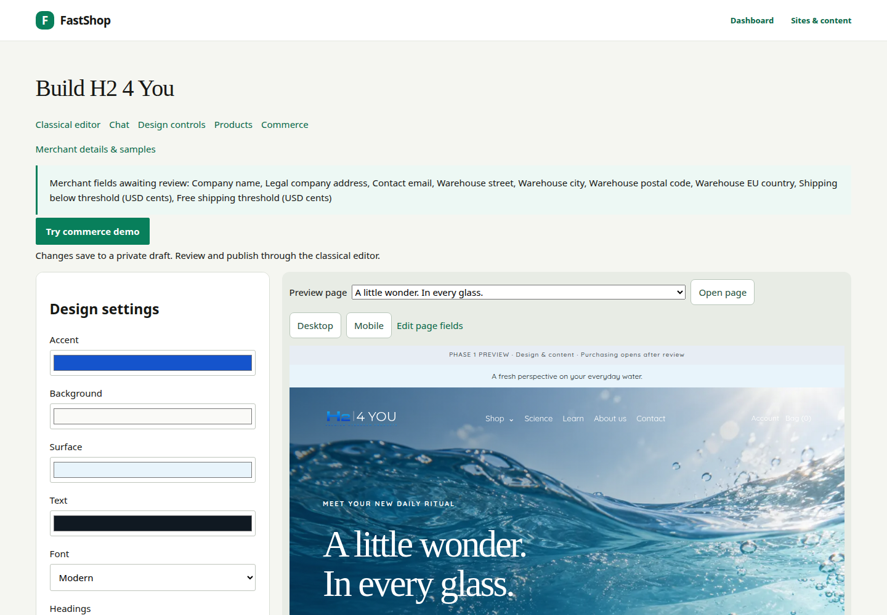

Choose **Design controls** for exact supported colors, spacing and typography.
Choose **Classical editor** for pages, navigation and publication. Return to chat
without copying content: all three views use the same saved draft.

Expand **Draft revision history** to inspect the latest 50 changes. **Undo latest
change** works only while that unchanged revision is current. It does not rewind
payments, catalog operations or published pages.

For a slow request, use **Cancel pending edit**. After a timeout, reload and inspect
the saved result before trying again. If another editor changed the draft, the
stale request is rejected rather than overwriting their work.

---

::: divider

## Prepare commerce

Only after Phase 1 review: confirm merchant details, try the isolated simulator
and prepare Stripe sandbox acceptance. Simulation is not a live store.

:::

---

## Replace and review merchant sample data

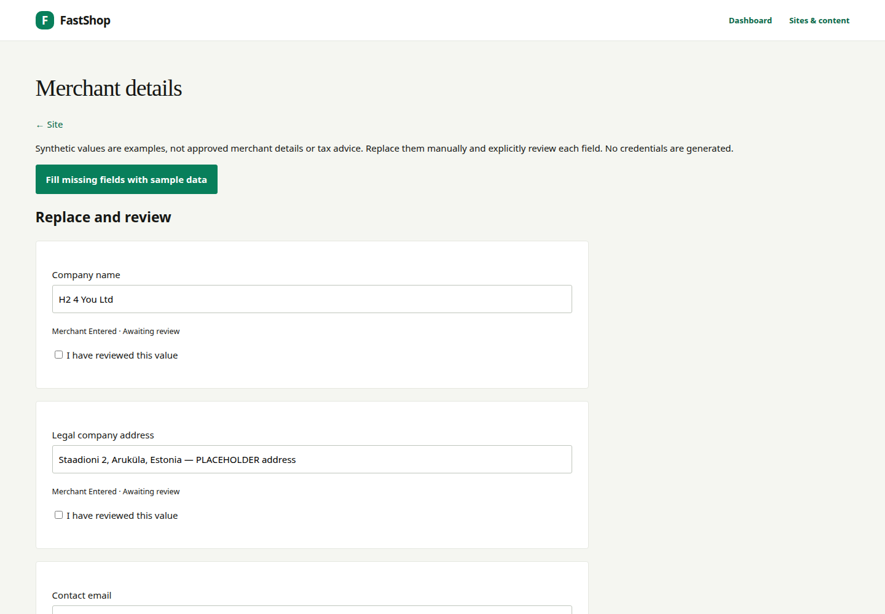

Open **Merchant details & samples**. On a private draft with commerce disabled,
**Fill missing fields with sample data** provides clearly labelled examples.
Existing values and previously reviewed fields are not blindly overwritten.

Replace company identity, legal address, contact email and EU warehouse details.
The shipping origin is distinct from the legal address. The final warehouse may
be in Estonia or another supported EU country; confirm it with the merchant.

Amounts are USD cents: `1000` is $10; `7500` is $75. The former is a training example,
not a confirmed H24YOU fee. Explicitly review each field. Saving does not publish,
approve tax registrations or activate payments.

---

## Prompt: propose shipping, then approve it

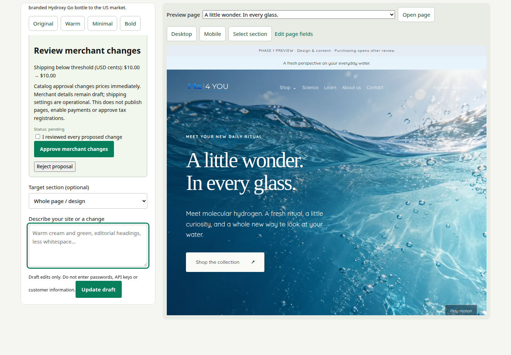

**AI prompt — adapted from brief §6 and subsequent EU-origin direction:**

> Propose US-only shipping from our confirmed EU warehouse. For this training
> example only, use a $10 flat fee and a $75 free-shipping threshold. Show the
> proposed values for merchant review. Do not enable payments or approve tax
> registrations. Do not change anything until I explicitly approve the proposal.

**No-key exercise:** `Shipping: 1000` proposes the $10 fee only.

Inspect **Review merchant changes**, tick **I reviewed every proposed change**
and approve—or reject. Stale proposals need a fresh request. Approved prices and
shipping are operational changes, not reversible page edits. Merchant-detail
proposals currently require commerce disabled.

---

## Try checkout without credentials

Open **Try commerce demo → Start private demo**. Its catalog, stock, shopper and
orders are separate from your real store. For this walkthrough, one sample item
was manually renamed **H24YOU training tablets — PLACEHOLDER**; other simulator
defaults are not H24YOU's approved catalog.

Set quantity and one-time/monthly purchase, then open **Checkout**. Enter a sample
US destination, confirm recurring consent where applicable and calculate the total.
Try both simulated approval and decline.

The displayed tax is an illustrative fixture, not a real state or ZIP rate.
No card details, actual payment, real email or fulfillment request is used.

---

## Configure US commerce through the explicit forms

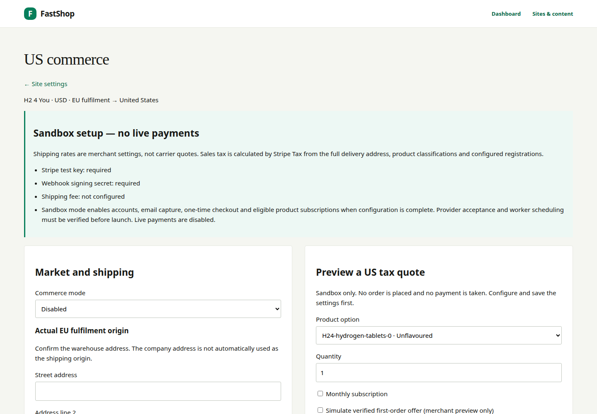

In **Commerce**, confirm EU origin, US destinations, shipping fee and threshold.
Review product tax classifications and registrations with the responsible merchant.
Use Stripe test credentials only for sandbox acceptance; live mode is not offered.

Real sandbox tax is calculated through Stripe Tax using the full delivery address,
not a hard-coded state percentage. A failed tax lookup must not become zero tax.
The final total must be reviewed before payment.

The first-order 10% offer and subscription 10% saving stack sequentially: **19%
combined before cent rounding**, not 20%. Verify supported payment methods; do not
show PayPal or wallet icons as accepted merely because the original brief listed them.

---

## Subscriptions: monthly tablets, explicit controls

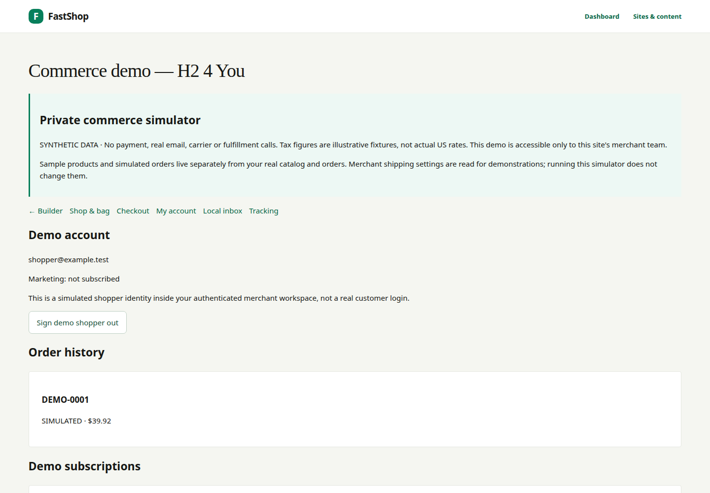

The H24YOU brief calls for monthly tablet delivery with 10% savings and future
flavour changes. In real catalog settings, enable subscriptions for tablets only.
The customer must explicitly consent before a recurring purchase.

In the simulator's **My account**, practice skipping a delivery, pausing/resuming,
changing frequency or flavour, updating address/payment and cancelling. Simulate
successful and failed renewals to inspect the resulting history.

The sample payment update is a label, not a stored card. Real recurring billing,
card updates, recovery, scheduled workers and notices require the separate Stripe
sandbox acceptance steps. Chat cannot activate or charge a subscription.

---

## My account and order tracking

After simulated checkout, request a **local demo sign-in** and confirm it in the
local inbox. This signs in the synthetic shopper inside the merchant simulator;
it is not a public customer account or proof of real email delivery.

Open **My account** for order history and subscription controls. Open **Tracking**
to mark a simulated order shipped and delivered, then return to the account to see
the updated history.

Real-store accounts use the configured customer email flow. Tracking events are
merchant-managed; the presence of a tracking field does not imply automatic DHL,
FedEx or postal-carrier integration.

---

## Email capture and the first-order offer

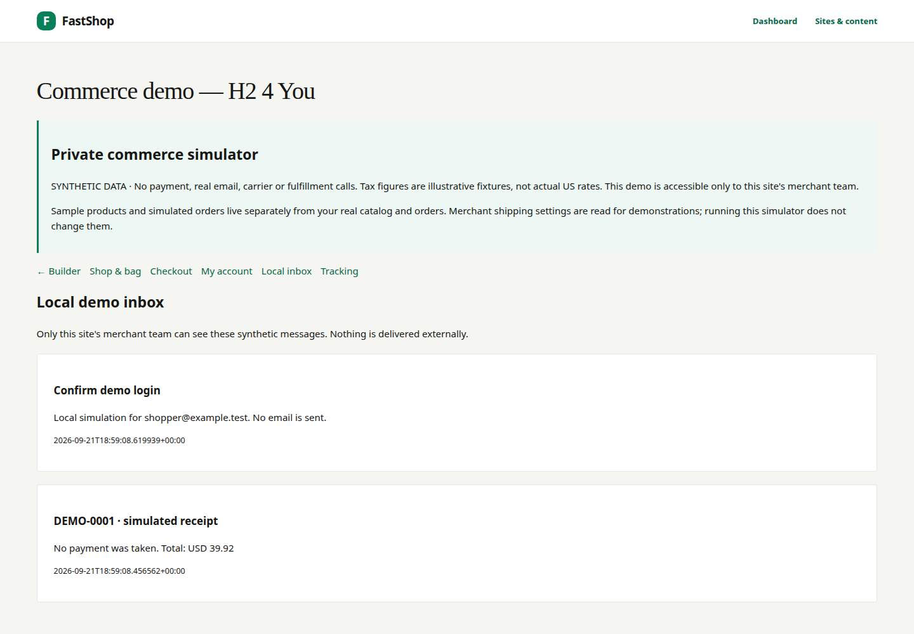

In the simulator, tick the separate marketing-consent checkbox and request the
welcome offer. Confirm the newsletter in **Local inbox** before using
`DEMO-WELCOME`. Newsletter confirmation and account sign-in are separate actions.

For the real storefront, use the configured email-provider workflow and verify
consent, confirmation, offer eligibility and unsubscribe. Do not call it Shopify
Email: this implementation uses FastShop's email boundary.

**Brief copy:** “I agree to receive marketing emails from H2 4 You. Unsubscribe
anytime.” Keep consent unticked by default and link the reviewed privacy policy.
Verify that banner dismissal is remembered and the banner never blocks the page.

---

::: divider

## Review and launch

Approve the design/content result separately from commerce. A complete-looking
preview can still contain unconfirmed prices, imagery, source figures and policies.

:::

---

## Phase 1 review: show the site before commerce

Walk through home, Shop, both products, Science, all three Learn articles, About,
Contact and legal pages with the merchant. Review header, footer, announcement,
offer preview and cookie controls on phone, tablet and desktop.

Confirm tone, visual language, navigation, SEO descriptions, alt text and video
fallbacks. Check research sources and remove invented or unapproved claims.
Keep sample reviews visibly labelled—or omit them until genuine reviews exist.

Record merchant approval before moving to commerce acceptance. Publishing the
first page can expose a public noindex preview: **noindex is not private access**.
Use authenticated previews for unpublished work.

---

## Phase 2 review: simulation, sandbox, launch

| Gate | Evidence required |
|---|---|
| Private demo | Synthetic checkout, offers, account, subscriptions, tracking and local mail work |
| Merchant review | Confirmed legal details, EU origin, US rates, product prices and tax settings |
| Stripe sandbox | Real test-provider tax, payment success/failure, webhooks and idempotency checked |
| Recurring operations | Renewal scheduling, payment updates, failure/recovery and notices exercised |
| Customer communications | Real test delivery, sign-in, marketing opt-in and unsubscribe verified |
| Launch decision | Reviewed content/policies, payment-method acceptance and deployment checks complete |

Never migrate simulated paid orders, fake cards or demo subscriptions into the
real store. Live payments remain a separate release decision. See the repository's
[Phase 2 acceptance register](PHASE2_ACCEPTANCE_STATUS.md) for unresolved provider gates.

---

## H24YOU placeholder replacement register

| Item | Merchant action before launch |
|---|---|
| Company and warehouse | Confirm legal address separately from actual EU fulfillment origin |
| Prices and shipping | Confirm tablet pack size/price, bottle USD price, flat fee and $75 threshold |
| Product facts | Supply ingredients, Supplement Facts, directions and approved bottle specifications |
| Photos and video | Replace generated hero/product/lifestyle concepts and motion studies |
| People and reviews | Supply founder details, approved portraits and genuine testimonials |
| Research | Recheck 2,000+ / 120+ / 68 figures, date, reference metadata and article drafts |
| Claims and policies | Obtain the brief-requested review; enable only approved statements |
| Brand and links | Supply licensed Lovera if wanted; replace social destinations and missing assets |
| Commerce providers | Verify tax, payment methods, mail, scheduled jobs and fulfillment workflow |

---

## Quick reference and source brief

| I want to… | Go to |
|---|---|
| Change copy or page structure | Classical editor → page → Save draft |
| Ask for a focused draft change | Build with AI → select page/section → Update draft |
| Change design precisely | Design controls |
| Change menu, banner, footer or counters | Brand and shared content |
| Edit variants/prices | Products; review operational impact |
| Replace merchant samples | Merchant details & samples |
| Try a safe shopping journey | Try commerce demo |
| Review payments, shipping and tax | Commerce; then the sandbox acceptance register |

**Source:** [H24YOU website build brief](H24YOU_SOURCE_BRIEF.md),
§§0–11. Prompt pages distinguish original wording from adapted examples. Linked
studies are the brief's references, not research newly verified for this guide.
Never paste passwords, payment details, API keys or customer records into chat.
